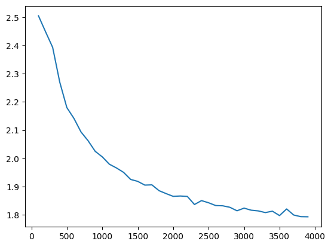

# jax-transformer
A transformer implemented purely in Jax

## Description
This repo has code for a very small character level GPT (~10.7M parameters) implemented purely in [Jax](https://jax.readthedocs.io/en/latest/index.html), no
Flax/Haiku etc from the strong Jax ecosystem used at all.

This includes all neural network modules (Dense, Embedding, Droupout, LayerNorm, Multihead Attention), optimizer (Adam with gradient clipping and weight decay) and loss function (with warmup and decay).
Jax uses a functional based approach which was really interesting and quite different to other low level libraries and ML frameworks.

The nn modules here are implemented as Python Classes that become PyTrees in Jax, which are essentially containers to hold the module parameters and a call function on how to use these parameters.

## Results
This GPT (in model.py with all the parameters in training.py) was trainined at a character level using a dataset of all text from Shakespeare's work. After a short peiod of training it could generate output such as

```text
KING EDWARD ICHARD:
Hast! I willl mounstion.

LEONTHUS:
May,
I may be sirt From me horse the brut care, be award,
And there who childs every I'll.

JULIET:
The dear, my livest: whell Herefors; foul the die the to I setet moy
By back in busst of the heave i
```

Which, if you squint hard enough, isn't too far off. The validation loss was around ~1.78:




### A few other bits left to do:
- Saving/checkpointing model weights and optimizer state
- Implement KV caching for fast decoding
- Profile and see what can be improved/made faster and see what gets recompiled unnecessarily
